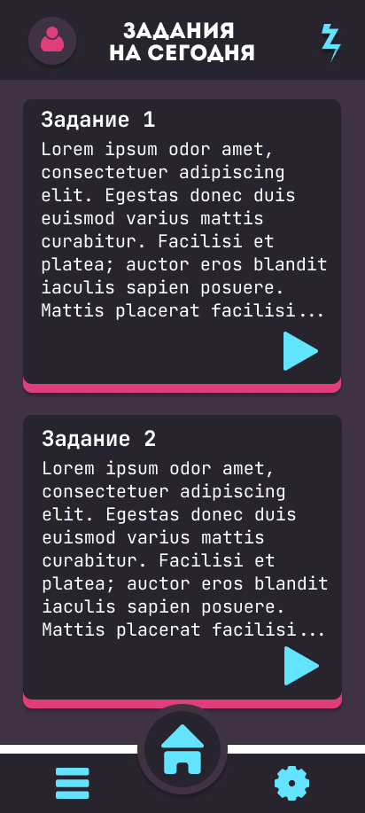
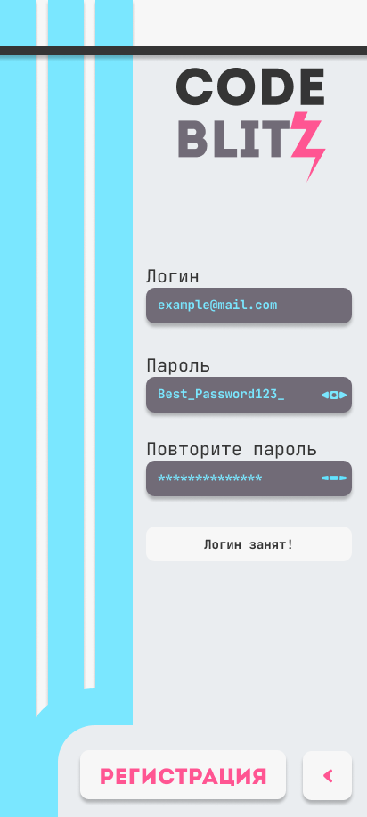
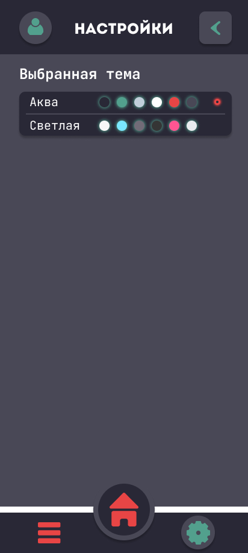

## CodeBlitz: Развивай свои навыки кодинга каждый день
Проект представляет собой мобильное приложение, которое загружает с бэкенда ежедневные задания на программирование для их решения на время и последующего просмотра результатов в таблице лидеров.
Присутствует выбор разных языков (без исполнения кода), смена тем, привязка выбранной темы к аккаунту пользователя, сохранение прогресса и обновление данных в реальном времени.

## Проект из колледжа по мобильной разработке
## В качестве бэкенда приложения использовалась Supabase, сейчас база там не поднята, поэтому проект не функционален

**Дизайн приложения:**  [Макет приложения - Figma](https://www.figma.com/design/rTUUWG5ZbsedkDY6VORlQI/CodeBlitZ?node-id=0-1&t=mqi5uEEH3r0rophJ-1)

**Примеры дизайна:**

---

---

---

